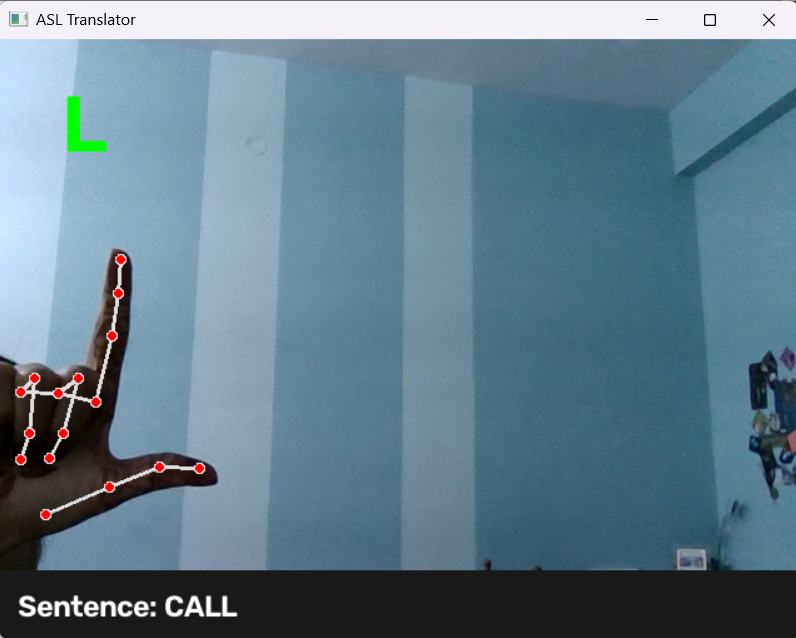

# Real-Time ASL Sign Language to Speech Translator

A computer vision and machine learning application that detects American Sign Language (ASL) hand gestures using a webcam and translates them into text and speech output in real-time.



## Features

* **Real-Time Hand Tracking:** Detects 21 3D hand landmarks using MediaPipe Hands.
* **Gesture Classification:** Uses a Random Forest Classifier trained on normalized landmark coordinates for robust angle- and distance-invariant recognition.
* **Text-to-Speech Output:** Audio pronunciation of recognized signs and constructed phrases via `pyttsx3`.
* **Live Webcam Interface:** Visual feedback displaying bounding boxes, landmark skeletons, and predicted characters via OpenCV.

---

## Tech Stack

* **Language:** Python 3.11+
* **Computer Vision:** OpenCV (`cv2`), MediaPipe
* **Machine Learning:** Scikit-Learn, NumPy
* **Speech Synthesis:** Pyttsx3

---

## Project Structure

```text
SignLanguageProject/
├── app.py                     # Main real-time translation application
├── extract_features.py        # Feature extraction from raw images/webcam
├── train_model.py             # Random Forest classifier training script
├── requirements.txt           # Project dependencies
├── demo.png                   # Application preview image
├── .gitignore                 # Git ignore rules for environments & models
└── README.md                  # Project documentation